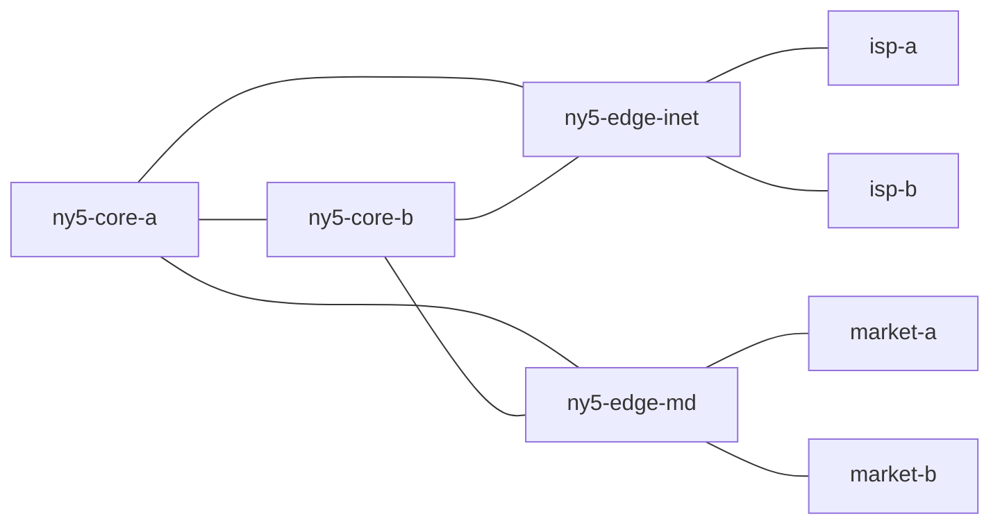

# Control Plane Lab

> A routing and incident-analysis lab for trading-style networks.

[](https://github.com/mohosy/control-plane-lab/actions/workflows/ci.yml)

Control Plane Lab is a command-line simulator for reasoning about how a multi-router network behaves before and after change. It models OSPF reachability, BGP path selection, next-hop resolution, and incident blast radius from a declarative topology file.

This project is aimed at the kind of questions a network engineering team actually has to answer:

- If an upstream or market data peer drops, do we fail over cleanly or blackhole traffic?
- Which routers change best path selection after a peering or link event?
- Can internal routers still resolve BGP next hops through the IGP after the topology shifts?
- How do simple policy choices like `local-pref` change forwarding behavior across the fabric?

## Why This Is Interesting

Most networking side projects stop at packet capture or interface counters. This one focuses on control-plane reasoning:

- OSPF shortest-path computation across a weighted fabric
- BGP route import/export policy with `local-pref`, AS-path handling, and `next-hop-self`
- Recursive forwarding from a BGP route into the IGP
- Scenario-driven incident analysis with before/after deltas
- JSON output support for automation and tooling

## Demo Topology

The included example models a compact trading-style environment:

- Two internal core routers
- An internet edge with primary and backup upstreams
- A market-data edge with primary and secondary peers
- Built-in probes that validate external reachability from internal routers



## Quickstart

```bash
python3 -m pip install -e .
make test
make demo
```

You can also run the CLI directly without installing:

```bash
PYTHONPATH=src python3 -m control_plane_lab summary examples/trading_fabric.json
PYTHONPATH=src python3 -m control_plane_lab routes examples/trading_fabric.json ny5-core-b
PYTHONPATH=src python3 -m control_plane_lab path examples/trading_fabric.json ny5-core-a 198.18.10.10
PYTHONPATH=src python3 -m control_plane_lab incident examples/trading_fabric.json --scenario examples/market_failover.json
```

## Example Output

### Topology summary

```text
Topology: Trading Fabric Lab
Routers: 8
Links: 9/9 active
BGP sessions: 12/12 active
Configured probes: 3

Router         ASN      Connected  OSPF   BGP    Total
isp-a          65100    2          0      1      3
isp-b          65110    2          0      1      3
market-a       65200    2          0      0      2
market-b       65210    2          0      0      2
ny5-core-a     65000    2          6      3      11
ny5-core-b     65000    2          6      3      11
ny5-edge-inet  65000    2          6      2      10
ny5-edge-md    65000    2          6      1      9
```

### Best path selection

`ny5-core-b` prefers the primary market peer because of `local-pref=300`, and prefers `isp-a` over `isp-b` because the internet sessions are weighted `250 > 200`.

```text
Best routes for ny5-core-b

Prefix             Protocol   Next Hop       AD     Metric Details
198.18.10.0/24     bgp        ny5-edge-md    200    0      origin=market-a lp=300 as=65200
203.0.113.0/24     bgp        ny5-edge-inet  200    0      origin=isp-a lp=250 as=65100
203.0.114.0/24     bgp        ny5-edge-inet  200    0      origin=isp-b lp=200 as=65110
```

### Reachability trace

```text
Path: ny5-core-a -> 198.18.10.10
Reachable: yes
Reason: destination reached on connected prefix

1. ny5-core-a uses 198.18.10.0/24 via bgp forwarding ny5-edge-md (origin=market-a lp=300 as=65200)
2. ny5-edge-md uses 198.18.10.0/24 via bgp forwarding market-a (origin=market-a lp=300 as=65200)
3. market-a uses 198.18.10.0/24 via connected forwarding local (origin=market-a)
```

### Incident blast radius

When the primary market peering drops, the topology stays up but traffic moves to the backup provider. The incident command reports both the changed routes and the changed forwarding path.

```text
Incident report for Trading Fabric Lab

Events:
- bgp-down ny5-edge-md<->market-a

Changed best routes: 3
Impacted routers: ny5-core-a, ny5-core-b, ny5-edge-md
Changed prefixes: 198.18.10.0/24

Probe deltas:
- Market data from core-a: reachable -> reachable
  before: ny5-core-a -> ny5-edge-md -> market-a
  after: ny5-core-a -> ny5-edge-md -> market-b
- Market feed from edge-md: reachable -> reachable
  before: ny5-edge-md -> market-a
  after: ny5-edge-md -> market-b
```

## CLI Commands

- `cplab summary <topology.json>` prints topology-level and per-router route statistics.
- `cplab routes <topology.json> <router>` prints the best route to every known prefix from one router.
- `cplab path <topology.json> <router> <destination-ip>` traces recursive forwarding hop by hop.
- `cplab probes <topology.json>` runs all built-in probes for the topology.
- `cplab incident <topology.json> --scenario <scenario.json>` applies failures and reports the routing delta.
- Add `--json` to any command when you want machine-readable output for automation.

## Design Notes

- Topologies are declarative JSON so they can be versioned, diffed, and extended like infrastructure.
- Router loopbacks are auto-added as connected `/32` prefixes and automatically advertised into OSPF.
- OSPF uses Dijkstra across active links and installs routes to every OSPF-advertised prefix.
- BGP supports originated prefixes, directed sessions, import/export prefix filters, `local-pref`, AS-path propagation, and `next-hop-self`.
- Forwarding traces recursively resolve BGP next hops through the OSPF graph, which is where many real blackhole mistakes show up.
- Incident analysis compares best-route selection before and after mutations such as `link-down` and `bgp-down`.

## Repository Layout

```text
src/control_plane_lab/
  cli.py            # command-line interface
  loader.py         # topology/scenario loading
  models.py         # topology schema
  simulation.py     # OSPF, BGP, forwarding, incident diff
examples/
  trading_fabric.json
  market_failover.json
tests/
  test_simulation.py
.github/workflows/
  ci.yml
```

## Future Extensions

The current model is intentionally compact, but it is structured to grow. Useful next steps would be route reflectors, OSPF areas, ECMP, prefix communities, explicit route-maps, interface shutdown events, and richer L2/ARP adjacency modeling.
