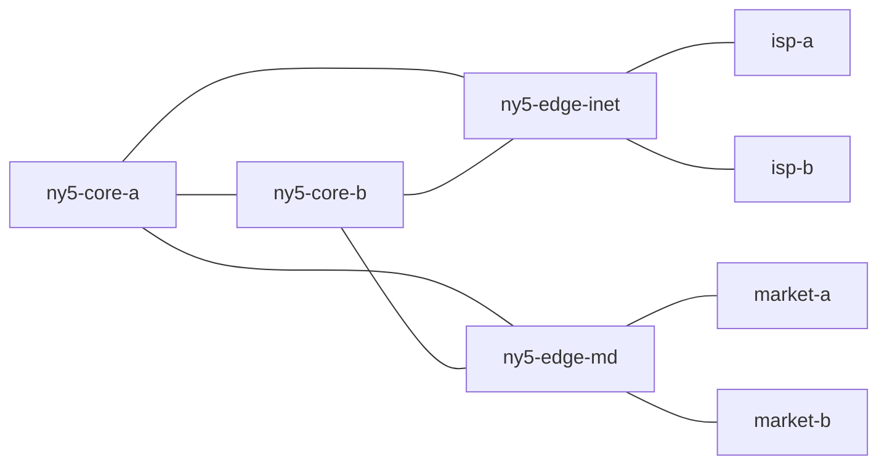

# Control Plane Lab

[](https://github.com/mohosy/control-plane-lab/actions/workflows/ci.yml)

Control Plane Lab is a command-line network simulation tool for analyzing routing behavior in multi-router environments. The project models OSPF reachability, BGP path selection, next-hop resolution, and the operational impact of topology or peering failures.

The repository is designed as a compact control-plane lab rather than a packet-level emulator. Its purpose is to make routing decisions and failure handling easy to inspect, test, and extend from declarative topology definitions.

## Overview

The simulator supports a practical subset of control-plane behavior that is useful for studying production-style network scenarios:

- Weighted OSPF path computation across an internal fabric
- BGP route origination and propagation across eBGP and iBGP sessions
- Import policy controls including `local-pref`
- `next-hop-self` behavior for internal route distribution
- Recursive forwarding analysis from BGP next hops into the IGP
- Incident comparison before and after link, peering, or prefix events
- JSON output for automation and downstream tooling

## Example Topology

The included example models a small trading-oriented network with:

- Two internal core routers
- An internet edge with primary and backup upstreams
- A market-data edge with primary and secondary external peers
- Built-in reachability probes for validating control-plane outcomes



## Installation

```bash
python3 -m pip install -e .
```

For local development:

```bash
make test
make demo
```

## Usage

Run the CLI directly from the repository:

```bash
PYTHONPATH=src python3 -m control_plane_lab summary examples/trading_fabric.json
PYTHONPATH=src python3 -m control_plane_lab routes examples/trading_fabric.json ny5-core-b
PYTHONPATH=src python3 -m control_plane_lab path examples/trading_fabric.json ny5-core-a 198.18.10.10
PYTHONPATH=src python3 -m control_plane_lab incident examples/trading_fabric.json --scenario examples/market_failover.json
```

After installation, the same commands are available through the `cplab` entrypoint.

### Commands

- `cplab summary <topology.json>` reports topology-level and per-router routing statistics.
- `cplab routes <topology.json> <router>` displays the best route to each known prefix from a selected router.
- `cplab path <topology.json> <router> <destination-ip>` traces forwarding decisions hop by hop.
- `cplab probes <topology.json>` runs all configured probes in the topology file.
- `cplab incident <topology.json> --scenario <scenario.json>` applies a failure scenario and reports route and reachability deltas.
- Add `--json` to any command for machine-readable output.

## Example Output

### Topology summary

```text
Topology: Trading Fabric Lab
Routers: 8
Links: 9/9 active
BGP sessions: 12/12 active
Configured probes: 3

Router         ASN      Connected  OSPF   BGP    Total
isp-a          65100    2          0      1      3
isp-b          65110    2          0      1      3
market-a       65200    2          0      0      2
market-b       65210    2          0      0      2
ny5-core-a     65000    2          6      3      11
ny5-core-b     65000    2          6      3      11
ny5-edge-inet  65000    2          6      2      10
ny5-edge-md    65000    2          6      1      9
```

### Route selection

In the example topology, `ny5-core-b` prefers the primary market route because it carries a higher `local-pref`, and prefers `isp-a` over `isp-b` on the internet edge for the same reason.

```text
Best routes for ny5-core-b

Prefix             Protocol   Next Hop       AD     Metric Details
198.18.10.0/24     bgp        ny5-edge-md    200    0      origin=market-a lp=300 as=65200
203.0.113.0/24     bgp        ny5-edge-inet  200    0      origin=isp-a lp=250 as=65100
203.0.114.0/24     bgp        ny5-edge-inet  200    0      origin=isp-b lp=200 as=65110
```

### Forwarding trace

```text
Path: ny5-core-a -> 198.18.10.10
Reachable: yes
Reason: destination reached on connected prefix

1. ny5-core-a uses 198.18.10.0/24 via bgp forwarding ny5-edge-md (origin=market-a lp=300 as=65200)
2. ny5-edge-md uses 198.18.10.0/24 via bgp forwarding market-a (origin=market-a lp=300 as=65200)
3. market-a uses 198.18.10.0/24 via connected forwarding local (origin=market-a)
```

### Incident analysis

When the primary market peering is withdrawn, the topology remains reachable and traffic moves to the backup peer. The incident report captures both the routing-table changes and the forwarding-path change observed by probes.

```text
Incident report for Trading Fabric Lab

Events:
- bgp-down ny5-edge-md<->market-a

Changed best routes: 3
Impacted routers: ny5-core-a, ny5-core-b, ny5-edge-md
Changed prefixes: 198.18.10.0/24

Probe deltas:
- Market data from core-a: reachable -> reachable
  before: ny5-core-a -> ny5-edge-md -> market-a
  after: ny5-core-a -> ny5-edge-md -> market-b
- Market feed from edge-md: reachable -> reachable
  before: ny5-edge-md -> market-a
  after: ny5-edge-md -> market-b
```

## Implementation Notes

- Topologies are defined in JSON so they can be versioned, diffed, and reused in scenarios.
- Router loopbacks are added automatically as connected `/32` prefixes and advertised into OSPF.
- OSPF uses Dijkstra over active links and installs routes to all OSPF-advertised prefixes.
- BGP supports originated prefixes, directed sessions, import and export prefix filters, `local-pref`, AS-path propagation, and `next-hop-self`.
- Forwarding traces recursively resolve BGP next hops through the OSPF graph.
- Incident analysis compares the selected best routes and probe results before and after topology mutations such as `link-down` and `bgp-down`.

## Repository Layout

```text
src/control_plane_lab/
  cli.py            # command-line interface
  loader.py         # topology and scenario loading
  models.py         # topology schema
  simulation.py     # OSPF, BGP, forwarding, and incident analysis
examples/
  trading_fabric.json
  market_failover.json
tests/
  test_simulation.py
.github/workflows/
  ci.yml
```

## Roadmap

The current scope is intentionally focused. Reasonable extensions include route reflectors, OSPF areas, ECMP, communities, route-maps, interface-level events, and richer adjacency modeling.
